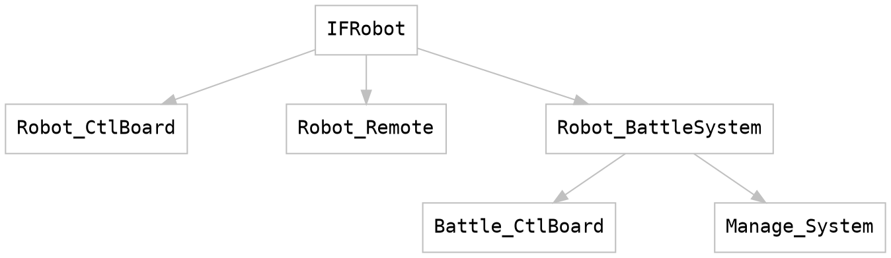

# MiniDream IFRobot

本仓库是关于MiniDream IFRobot 的所有开源资料。

***I'm a fan of Robot.***
从小就有着机甲梦的我，之前一直有参加Robomaster机器人大赛，组建的队伍名字叫DreamTeam，偶然间看到RTT的公众号上有这个活动，便萌生新意，想要从新设计一套能够用于新生学习、锻炼能力的机器人对战平台，于是就有了MiniDeam。

### 项目架构组成

**Robot_CtlBoard**：IFRobot的底盘核心主控，功能包括：
电机控制、舵机控制、灯光控制、蜂鸣器、调试接口、wifi通讯、电量显示、运行状态显示和外围扩展通讯接口等。
详细信息：[Robot_CtlBoard](Robot_CtlBoard/README.md)

**Robot_Remote**： IFRobot的通用遥控器，功能包括：
多路模拟量采集、多个按键、电量显示、蜂鸣器、串口无线通讯和与PC端上位机通讯交互等。
详细信息：[Robot_Remote](Robot_Remote/README.md)

**Robot_BattleSystem** IFRobot的对战系统，功能包括：
激光发射与接收、灯光控制、声效控制、显示生命值、RFID通讯交互、与核心主控交互接口上传机器人信息等。
详细信息：[Robot_BattleSystem](Robot_BattleSystem/README.md)

### 后记
由于前阵子刚比完赛，最近又要中期答辩了，架构虽然起好了，但进度确实慢了些，一点点增加吧...

