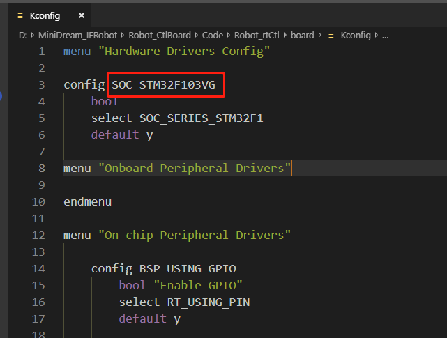
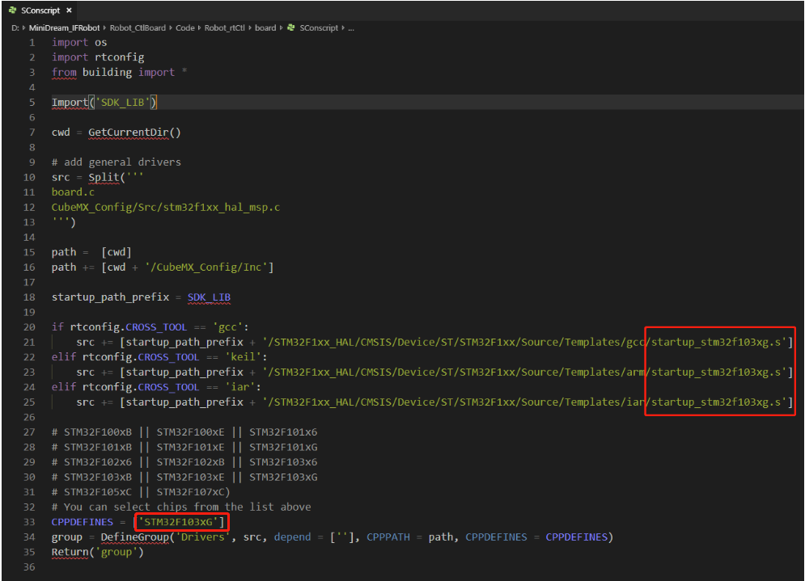
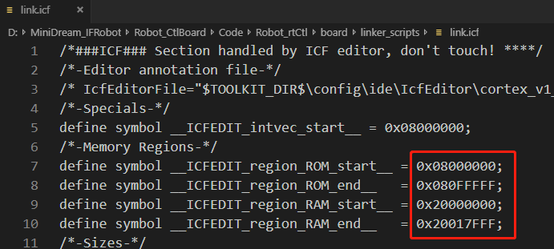
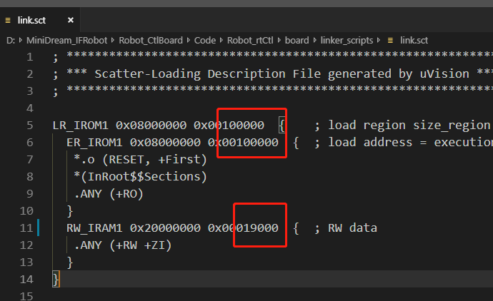
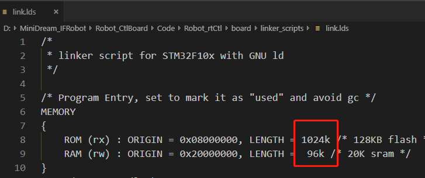
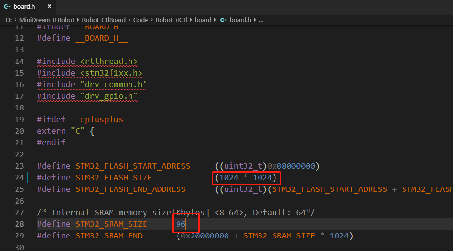
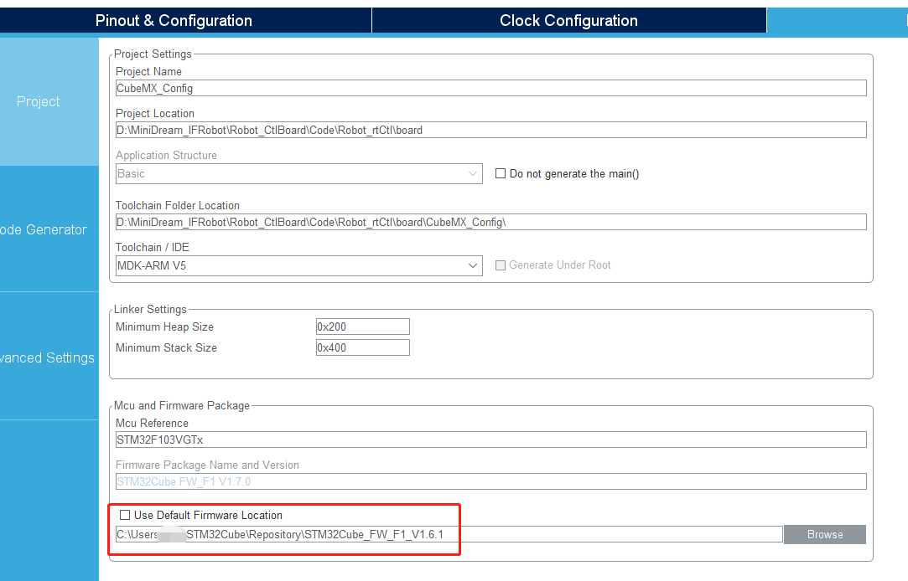

# IFRobot 主控rttBSP移植过程

​	截至目前，rt-Thread（以下简称rtt）的稳定维护版本为3.1.3，可以从[github](https://github.com/RT-Thread/rt-thread/releases)通过clone指令下载到本地(git的国内速度实在无法恭维，为了方便下载，我将其传到了[百度云](https://pan.baidu.com/s/16Ep-ejMs57VcLfBi2XEYWA)，提取码：ds9q)。下载后解压就可以得到rtt源代码库，具体的目录介绍参考官方的[初识RT-Thread教程](https://www.rt-thread.org/document/site/tutorial/kernel/kernel-video/)，其中有个bsp文件夹内包含了对很多的开发板板级驱动支持，不过由于我用的是自己画的开发板，虽然基于STM32F103主控，但外设配置与bsp中的开发板显然有差别，自己对rtt又不是很熟悉，所以我决定自己从移植BSP工程开始这次比赛的软件部分任务。

### BSP移植初试---失败

​	针对BSP移植，官方已经提供了[移植教程](https://github.com/RT-Thread/rt-thread/blob/master/bsp/stm32/docs/STM32%E7%B3%BB%E5%88%97BSP%E5%88%B6%E4%BD%9C%E6%95%99%E7%A8%8B.md)，教程先是介绍了BSP框架和所需的知识储备，然后基于正点原子的akt-nano开发板为例讲解的如何为新的开发板添加BSP，由于最开始我想脱离rtt库文件夹，新建个自己的工程文件夹，并按照自己想法改变了目录结构，然后按照该教程进行的移植，前面cubumx和内存修改都很顺利，到了修改kconfig编译的时候，就遇到了n多的路径问题，我想根据错误信息就挨个改配置文件呗，从kconfig到SConstruct再到SConscript，全都改了一个遍，改到我怀疑人生怀疑rtt的env工具如此鸡肋么，最后终于env工具的scons --target=mdk5编译过了，但打开keil工程后发现所有的源文件都带有叹号，找不到源文件......“是不是一开始就错了？不改瞎改目录结构呢？”喝了一瓶冰阔落冷静了下来之后，问了下rtt的技术小哥，他给我提了个scons的命令"scons --dist"，一个可以通过env工具吧rtt生态核心代码剥离rtt库目录，生成独立的dist工程目录的操作，于是上面遇到的问题就都tm解决了。。

###BSP独立工程移植过程

rtt库目录中将工程文件夹作为bsp的子项存在，想必会有伙伴和我一样，想让自己的工程独立出来，反而rtt作为工程的组件存在，那就可以按照如下方法来操作，以```STM32F103VGT6```为例。

#### 1复制通用模板

与官方的教程一致，复制```libraries/templates下stm32f10xx```工程模板到```RTT_ROOT/bsp```目录中，目的是为了保证配置文件中的路径正确。

####2修改board目录文件

修改board文件夹中的如内容：

##### kconfig

将config 改成相应芯片的名字



##### SConscript

按照官方教程，将启动文件改成相应的，本例子中改成了```startup_stm32f103xg.s```



#####linker_scripts 文件夹

按照官方教程，更改芯片的flash和ram大小。







##### board.h



##### CubeMX_Config文件夹

按照官方教程中方法修改并配置，只是需要注意的是，最新版stm32F103HAL库是1.7.0，其中的can组件st官方重构了整个库，与上一版本差别很大，而rt-Thead中的hal库是1.6.1版本的，所以在cubeMX配置中要进行如下设置：



然后继续按照官方教程复制systemclock_config()函数。

#### 3使用scons --dist 生成独立工程文件

在stm32f10x文件夹中使用env工具，输入scons --dist命令，生成独立的dist文件夹，其中就完成了对rtt库的独立操作，将生成好的dist/stm32f10x拷贝到你需要的地方，在按照官方教程中修改工程模板，重新生成工程等操作，就可以方便的继续玩耍了。


#### 后记

通过对rtt模板工程的正确移植，才感觉rtt并不是开始我瞎搞时想的那么鸡肋，相反，它有着别的rtos不具备的特点，期望通过后面的使用，我可以更好的掌握并使用rt-Thread.